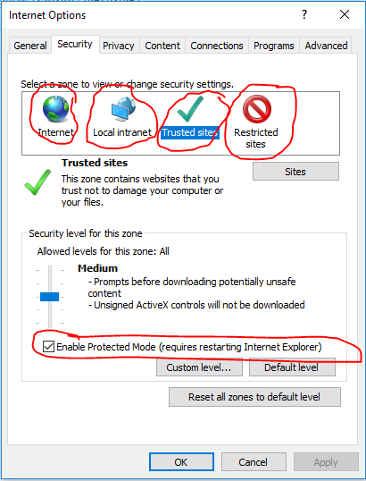
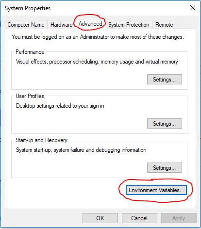
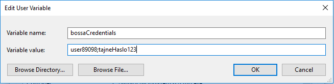
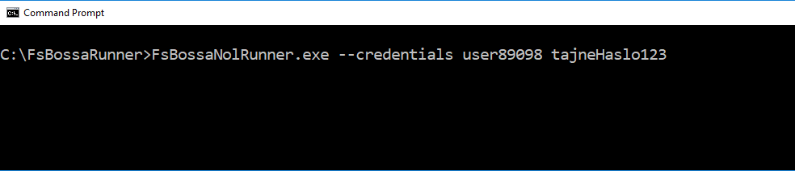

# fs-bossa-nol-runner

The source code of the [BossaNolRunner NuGet package](https://www.nuget.org/packages/BossaNolRunner/) which alows user to run [NOL 3](http://bossa.pl/oferta/internet/pomoc/nol/) application automatically (via *Chrome*, *FireFox* or *Internet Explorer* browsers) from .NET code.

Project is built with:

* [.NET Standard 2.1 / Core 3.1](https://dotnet.microsoft.com/download/dotnet-core/3.1/)
* [F#](https://fsharp.org)
* [Canopy](https://lefthandedgoat.github.io/canopy/) (F# wrapper for [Selenium](https://www.seleniumhq.org/))
* [Argu](http://fsprojects.github.io/Argu/)

Running NOL3 is done in 3 simple steps:

* opening a browser (Chrome, FireFox or Internet Explorer)
* login to [bossa.pl account](https://www.bossa.pl) using credentials provided as an application parameters or stored in environment variable
* starting NOL 3

## Browser Drivers

The application which uses this package also needs browser driver (for Chrome, FireFox or Internet Explorer accordingly). Drivers can be:

* downloaded from [Selenium download page](https://www.seleniumhq.org/download/) and copied into execution folder of the final application
* added as a .Net Core packages (see [Samples](https://github.com/zbigniew-gajewski/bossa-nol-runner/tree/master/Samples))

In order to make Selenium driver working correctly, **Internet Explorer** requires all ***internet zones*** parameter (*'Internet'*, *'Local intranet'*, *'Trusted sites'*, *'Restricted sites'*) set with identical ***'Enable Protected Mode...'*** settings (checked prefered):



## Browser parameter

The package can run Chrome, FireFox or Internet Explorer browser by providing **--browser** parameter:

* **--browser chrome** for running Chrome
* **--browser firefox** for running FireFox
* **--browser ie** for running Internet Explorer

**'--browser'** parameter is optionl, the default is **Chrome**.

## Credentials

User name and password to Bossa.pl account can be provided:

* as an application parameter: **--credentials [userName] [password]**
* as an **bossaCredentials** environment variable separated by semicolon:
  
  

  


## Usage

If you are using this package in your project and if you want to run or debug your application from your IDE (Visual Studio or from Visual Studio Code) remember to add the tag **CopyLocalLockFilesAssemblies** set to **true** to **PropertyGroup** element (see [Samples](https://github.com/zbigniew-gajewski/bossa-nol-runner/blob/master/Samples/NolRunnerAppCs/NolRunnerAppCs.csproj)):

```
<CopyLocalLockFileAssemblies>true</CopyLocalLockFileAssemblies>
```

This is because canopy dll requires to have browser driver in the same location. An example project should look like this:

```
<Project Sdk="Microsoft.NET.Sdk">

  <PropertyGroup>
    <OutputType>Exe</OutputType>
    <TargetFramework>netcoreapp3.1</TargetFramework>
    <CopyLocalLockFileAssemblies>true</CopyLocalLockFileAssemblies>
  </PropertyGroup>
  <ItemGroup>
    <PackageReference Include="BossaNolRunner" Version="1.0.5" />
    <PackageReference Include="Selenium.WebDriver.ChromeDriver" Version="80.0.3987.10600" />
    <PackageReference Include="Selenium.WebDriver.IEDriver" Version="3.150.1" />
    <PackageReference Include="Selenium.FireFox.WebDriver" Version="0.26.0" />
  </ItemGroup> 
</Project>
```

Usage examples from F# or C# are in [Sample](https://github.com/zbigniew-gajewski/bossa-nol-runner/tree/master/Samples) folder:

* **[Sample/NolRunnerAppFs](https://github.com/zbigniew-gajewski/bossa-nol-runner/tree/master/Samples/NolRunnerAppFs)** folder contains F# application using this package
* **[Sample/NolRunnerAppFs](https://github.com/zbigniew-gajewski/bossa-nol-runner/tree/master/Samples/NolRunnerAppCs)** folder contains C# application using this package

After compilation from within corresponding folder (NolRUnnerAppFs or NoRunnerAppCs):
  
  **dotnet build**

  the application can be executed with parameters:

  **dotnet  run   --browser  chrome   --credentials  [username]  [password]**

  
  
  If credentials parameters are not provided then ***user name*** and ***password*** will be taken from environment variable **'bossaCredentials'**. If there are no credentials provided as an application parameter nor stored in environment variable then the application will not run (neither browser nor NOL3).

The package was tested using:

* **Windows 10** 1909 18363.836
* **Chrome**  83.0.4103.61
* **FireFox** 76.0.1
* **Internet Explorer** 11
* **NOL 3** 3.1.15.237
* [**VS2019 16.6.0**](https://www.visualstudio.com/pl/downloads) (with F# Desktop Components)

*The package will not be actively maintained.*
